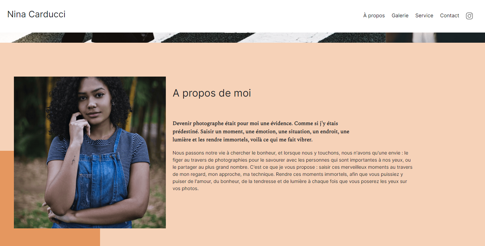

# Portfolio Nina Carducci - Openclassrooms

## Description

Correction de bugs. Optimisation du site : compression et redimmensionner les images. Amelioration du SEO : utilisation de balises sémentiques et de meta description, accessibilité renforcée. Un meilleur référencement à l'aide de rich snippet et de cartes twitter, facebook; utilisatoin de site schema.org.

**Tags**: *Optimisation, SEO, Référencement, Accessibilité*

  

